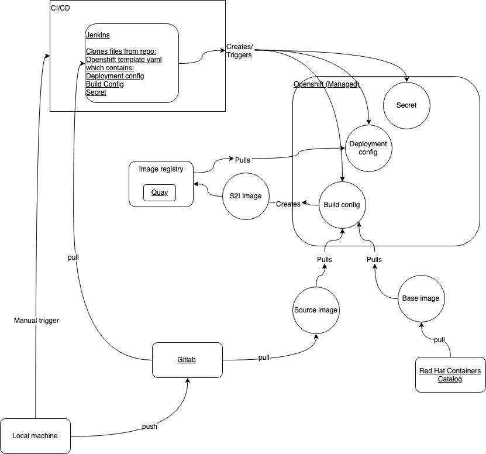

# Why did I opensource my code from working at Red Hat?
To make this code I have relied upon countless charitable coders who made their code public. I wanted to follow their example and give back to the community by allowing others to search my code as well.
If you use Eloqua as your Marketing Automation Platform (MAP) and wish to use Python and Openshift to automate visibility into the health of your marketing data, then this repo may help you.

Please fork, comment, or pull request; my code is ugly and can vastly improve.

# ViSOR - Vital Signs and Operational Reports
The ViSOR solution guide on Mojo: https://REDACTED.redhat.com/docs/DOC-000

# File Structure

- dashboard
  - Customer facing information that visor gathers. Very high level information
  - Contains the schematic
- grafana
    - Anything related to the Grafana application
    - Currently the JSON of the dashboards are stored here as backups. Maybe one day the dashboards will be stored and pulled from files in the repo
    - Username: admin; password: admin
- monitor
    - All the files to make the monitoring by ViSOR work
- prometheus
    - Prometheus
        - The metric gathering and alert triggering
    - Pushgateway
        - The persistent storage for the ephemeral monitoring scripts (python scripts in monitor push here)
    - Alertmanager
        - Handles the alerts after Prometheus triggers them

Changelogs are kept under each directory to better track change timelines for individual processes

# Repo Structure

- `master` -  PROD
    - *(yes, I know best practice would be to have a staging environment and a release branch--we're fine)*
- `develop` - testing environment; PREPROD
- `develop/{feature}` - branch for developing a specific need so that develop can remain being used for testing
- `stage` - second branch to be chosen from the drop down in the Jenkins Job Builders in case two the tests in the develop branch are only temporary

# Development Process

## New feature
New feature/bugfix process, start-to-finish:

1. Create new feature branch of relevant job dev branch
    - Example (http://danielkummer.github.io/git-flow-cheatsheet/):
      + `git flow feature start MYFEATURE`
2. Write amazing code
3. Test locally
    -  Command line/IDE/IPython
4. Merge to `develop` branch
    - Make sure local copy is up-to-date with remote: `git pull origin develop`
    - `git flow feature finish MYFEATURE`
6. Push to Gitlab repo
    - `git push origin develop`
7. Run Jenkins build and/or deploy for develop (TODO: automatically trigger Jenkins Build)
8. Update relevant changelog file

## New release
New release of features deployed to PROD:

1. Compare the dev and prod versions of grafana
    - Suggested way to compare:
      - Open both in tabs of the same browser window
      - Alternate between the two tabs so that the graphs' position are maintained, allowing better comparison for the graphs' lines.
      - Page down (fn + down arrow) and repeat the previous step
2. Create merge request from `develop` to `master` 
    - In Gitlab, go to *Merge Requests*
    - Click *New Merge Request*
    - Select source branch `develop`
    - Select target branch `master`
    - Click *Compare branches and continue*
    - Enter merge name and description and click *Submit merge request*
3. Ideally, merge should be approved by another teammate
4. Run Jenkins build and/or deploy for master

## Grafana
How to update the grafana dashboard in prod: 
- copy json of dev (the username of admin and password is admin)
- paste in the configmap in the Openshift template in the Grafana folder: https://REDACTED.redhat.com/REDACTED/visor/blob/develop/grafana/configs/deploy.yaml

# CI/CD
Flow: https://www.draw.io/#G1P3rzEItkSJ0exwkd0_udDnjs4FJ8EAda

What does Jenkins touch during a `Jenkins Manage Jobs - VISOR` build?
- Trigger with LIMIT argument "Pipeline.yaml": https://jenkins.paas.redhat.com/job/Jenkins-Jobs-VISOR/build?delay=0sec
- Which pulls and starts from: https://REDACTED.redhat.com/REDACTED/mktg-ops-pipeline/blob/develop/jobs/Pipeline.yaml 
- Which steps through each project (currently, two: managedplatflasktest and visor)
- And finishs by creating a job with these configs in https://jenkins.paas.redhat.com/job/VISOR/

What does Jenkins touch in the JJB created by the `Jenkins Manage Jobs - VISOR` build?
- Those jobs in https://jenkins.paas.redhat.com/job/VISOR/ have parameters defined in the job-template (at the bottom of /REDACTED/mktg-ops-pipeline/jobs/Pipeline.yaml) that are what will be passed to the JJB's target.
- The JJB uses the template_repo and template_directory parameters from the Pipeline.yaml to target and trigger /REDACTED/mktg-ops-pipeline/src/main/groovy/pipelines/deploy.pipeline
- Which triggers /REDACTED/REDACTED/src/com/redhat/mktg_ops/pipeline/DeployApp.groovy
- Which then processes the /REDACTED/visor/managedplatflasktest/configs/build.yaml

# Tests
## Confirm Successful Deployment
If this grafana graph shows `current` values in the legend, then the deployment was successful: https://grafana-visor.REDACTED.redhat.com/d/IL9XgdiWk/prom-a?refresh=1m&panelId=000&fullscreen&orgId=1
This graph shows
- Monitor scripts are pushing metrics to Pushgateway
- Prometheus is scraping from Pushgateway
- Grafana is rendering from Prometheus

Alertmanager is the only application not confirmed by that graph.

## Check Resource Usage
This is the IT PaaS managed Grafana:
https://grafana-openshift-monitoring.infra.us-west.dc.preprod.paas.redhat.com/d/000e46e4e5c7ba40a000ef7b23

It will show what amount of the requested resources are being used. The applications should use most of their requested resources.

I found it by recommendation of this Mojo question: https://REDACTED.redhat.com/message/000

# Other

## Signing into Managed Platform 
    https://docs.google.com/document/d/1UVI3nwkpMKaUPGKIJgjF82W-lkxALOyJgBiXTsJl4cU/edit#bookmark=id.6o000smo7f

### Accessing Managed Plat by OC (Openshift Console) CLI (Command Line Interface)
    https://docs.google.com/document/d/1UVI3nwkpMKaUPGKIJgjF82W-lkxALOyJgBiXTsJl4cU/edit#bookmark=id.wl7dig96izqj

## Mailing list
CURRENTLY FOR VISOR PERSONNEL ONLY

mo-visor mailing list

Your mailing list admin password is: 3xdMXZ4KN77i

Use the URL below to change your mailing list admin password:
https://post-office.corp.redhat.com/mailman/admin/mo-visor/passwords

Please note that this password is the same for all admins of the list, so notify your fellow owners when it is changed.
Please also note that your mailing list starts with no members (including yourselves). Please be sure that your initial 
audience is added to the list as you see fit.

***Important Links:***

[1]Go to this URL to log into the admin console:
https://post-office.corp.redhat.com/mailman/admin/mo-visor

[2]Provide this URL to users so they can subscribe to your list:
https://post-office.corp.redhat.com/mailman/listinfo/mo-visor

[3]Be sure to check out the Mailing List User Guide for helpful information regarding the use and administration of your new mailing list:
https://redhat.service-now.com/rh_ess/kb_view_customer.do?sysparm_article=KB000

## Grafana
The username is admin and the password is admin

## Network activity

### Egress Rules

These control to which domains your Pod's network activity can reach (very specific holes in the firewall):
https://REDACTED.redhat.com/paas/egress-firewall-preprod/blob/master/visor/dc-us-west/visor/itpaas-egress-firewall.yaml

Our fork: https://REDACTED.redhat.com/REDACTED/egress-firewall-preprod

### HTTP_PROXY env var alternative

Alternatively, you can use as environment variables the general proxies which all access to non-specificed domains:
- name: HTTP_PROXY
  value: REDACTED.redhat.com:000
- name: HTTPS_PROXY
  value: REDACTED.redhat.com:000

This is less secure than the specific egress rules and therefore discouraged. For ViSOR, they are only used in building images (standard practice) and in URL monitoring (https://REDACTED.redhat.com/REDACTED/visor/blob/develop/monitor/visor_url.py#L000).

## Transitioning from Open PaaS to Managed PaaS

See my visorGeneralRepoChangeLog.txt notes from 000-01-22 to 000-06-04:
https://REDACTED.redhat.com/REDACTED/visor/blob/develop/visorGeneralRepoChangeLog.txt#L000

## Known issues

- Redundancy
    - Monitoring is a single pod
    - Prometheus is faux high availability by having two prometheus instances, but they aren't linked at all
- Images
    - Prometheus and pushgateway use none red hat sanction images